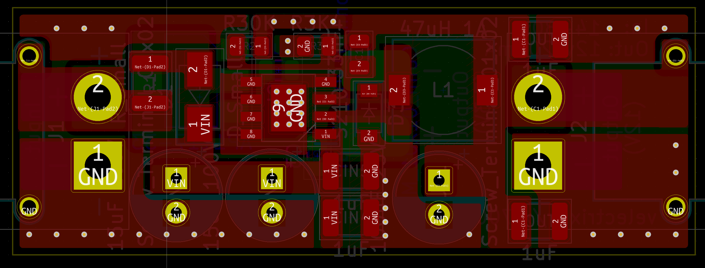
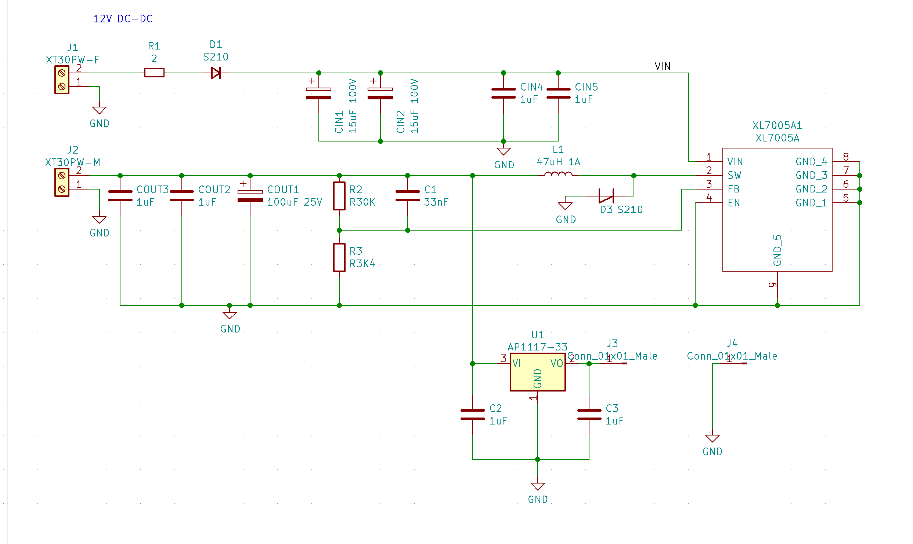

# xl7005-module

XL7005-based DC-DC converter module design, with optional space for LDO for lower-voltage rails.

**PCB layout, XL7005 side:**

(Populating the other side is optional, it features space for an LDO)

**Schematic:**

**Status:** Tested, everything works.

**Features:**

* XT30 input and output connectors for main input and ouptut
* Features space for an optional LDO to provide a low-power rail for e.g. a microcontroller. If not populated, the back of the board is empty. Can be any of the common SOT223 "1117" style.
* 2 Layer.